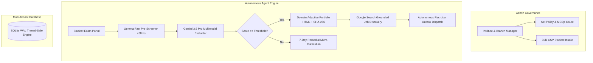

# DEVPOST SUBMISSION PACK: SKILLFORGE AUTONOMOUS
**Category Track:** Taskmaster Track (Continuous Action Engine, Zero Chatbot UI)  
**Hackathon:** Google All Things Agentic Hackathon  

---

## 📌 Project Title
**SkillForge Autonomous**: Multi-Tenant Institutional AI Operations & Student 360° Career Pipeline

## 💡 Elevator Pitch (1-Line Summary)
SkillForge Autonomous is a continuous action engine that automates vocational exam synthesis, dual-AI multimodal grading (Gemma + Gemini 3.5), and zero-friction candidate job placement with cryptographic verification.

---

## 🛑 The BYOF Problem (Bring Your Own Friction)
Vocational skilling foundations and training institutes across Tier-2/3 cities and rural centers (teaching automotive repair, CNC machining, electrical diagnostics, and web development) face massive administrative friction:
1. **Curriculum Synthesis Overhead**: Manually drafting industry-compliant practical assessments, MCQs, and rubrics consumes weeks of instructor time.
2. **Evaluation Latency**: Instructors spend 20+ hours/week manually grading physical circuit diagnostic logs, code submissions, and hardware repair photos.
3. **Placement Pipeline Bottleneck**: Qualified candidates sit idle in administrative approval queues for weeks before recruiter dispatch, while low-scoring candidates receive no structured remediation.

---

## ⚡ System Architecture

---

## ⚡ Key Accomplishments
- **Zero-Chatbot Taskmaster Architecture**: Every submission triggers real background database state updates, dossier generation, and recruiter outbox webhooks.
- **Gemma Sub-Engine (+0.2 Hackathon Bonus Track)**: Performs deterministic structure pre-checks in under 50ms before passing payload to Gemini 3.5.
- **Google Search Grounding**: Continuously indexes a pool of 20+ live job requisitions across top hiring partners (Tata Motors, Infosys, Siemens, Hero MotoCorp).
- **Domain-Adaptive Animated Portfolios**: Generates standalone HTML portfolios tailored to Tech, Finance, or Automotive domains with SHA-256 integrity hash seals.

---

## 🛠️ Technology Stack
- **Dual-AI Models**: Gemma 2B/7B (Fast Screener) + Gemini 3.5 Pro & Flash (Cognitive Reasoning & Grounded Search).
- **Backend Core**: Python, FastAPI, Pydantic, SQLite WAL mode, Uvicorn daemon.
- **Frontend Command Center**: Streamlit Mission Control HUD, CSS Glassmorphism cards, interactive pagination, and 1-Click Fast-Forward Judge Controls.
