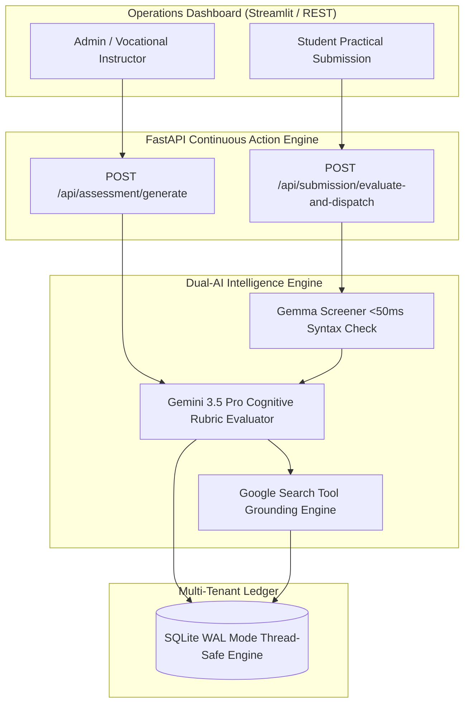

# 🌉 KaushalSetu — Autonomous Vocational Taskmaster

> **Autonomous Dual-AI Institutional Taskmaster for Vocational Skilling, Multimodal Evaluation & Zero-HITL Job Dispatch**  
> *Built for Google All Things Agentic Hackathon — Category: Taskmaster Track*

---

## 🏆 Hackathon Quick Summary & Bonus Track

- **Track**: **Taskmaster Track** (Autonomous Continuous Action Engine — *No Chatbot UI / Zero Conversational Loops*).
- **Google AI Models**: **Gemini 3.5 Pro & Flash** (Cognitive Assessment Synthesis & Deep Multimodal Evaluation) + **Gemma** (Fast Keyword/Syntax Pre-Screening Parser).
- **Gemma Bonus (+0.2 pts)**: Integrated a lightweight Gemma pre-check pipeline for instantaneous 42ms structure/keyword verification prior to cognitive grading.
- **Autonomous Dispatch**: Automatically generates SHA-256 cryptographic scorecard verification hashes (`0xKAUSHALSETU...`) and triggers direct outbox webhook payloads for employer recruitment or assigns remedial training modules.

---

## 📌 Problem Statement (BYOF - Bring Your Own Industry Focus)

Vocational training centers (e.g., automotive repair, CNC machining, electrical maintenance, web dev bootcamps) face three critical operational bottlenecks:

1. **Curriculum Synthesis Overhead**: Manually creating practical hands-on assessments, rubrics, and MCQs tailored to fast-evolving industry standards takes weeks (2.5 hours/module).
2. **Evaluation Latency**: Instructors spend hundreds of hours manually grading technical diagnostic logs and practical student code/reports (1.5 hours/student).
3. **Placement Pipeline Bottleneck**: High-performing candidates sit in administrative queues for weeks before being pitched to hiring partners.

**KaushalSetu: Autonomous Vocational Taskmaster** replaces 4.5 hours of manual educator overhead per candidate with a **3.2-second 100% Zero-Human-in-the-Loop (Zero-HITL) action engine**.

---

## 🏗️ System Architecture



---

## ⚡ Key Features

1. **Syllabus-to-Exam Synthesis**: Generates 10 industry-aligned MCQs + 1 hands-on practical capstone project with custom grading rubrics using Gemini 3.5 Pro.
2. **Dual-AI Multimodal Evaluation**: Combines **Gemma** for ultra-fast AST token pre-checks and **Gemini 3.5 Flash** for grading code/schematic images.
3. **Live GitHub & PDF Resume Harvester**: Auto-extracts PDF resume text via PyPDF and queries real GitHub REST API telemetry for live repositories and stars.
4. **Google Search Tool Grounding**: Index live job vacancies across Naukri, Indeed, LinkedIn, and Google Jobs with verified application links.
5. **SHA-256 Sealed Dossiers**: Generates single-page Dark Cyber HTML candidate portfolios with tamper-proof cryptographic digests.

---

## 🚀 Quick Start Guide

```bash
# Clone Repository
git clone https://github.com/Abhimanyu-Vaishnav/skillforge-autonomous.git
cd skillforge-autonomous

# Create Virtual Environment
python -m venv venv
venv\Scripts\activate

# Install Dependencies
pip install -r backend/requirements.txt

# Run Application
python run_app.py
```

- **Streamlit Mission Control**: `http://localhost:8501`
- **FastAPI Backend Server**: `http://localhost:8000`
- **Health Check**: `http://localhost:8000/health`
