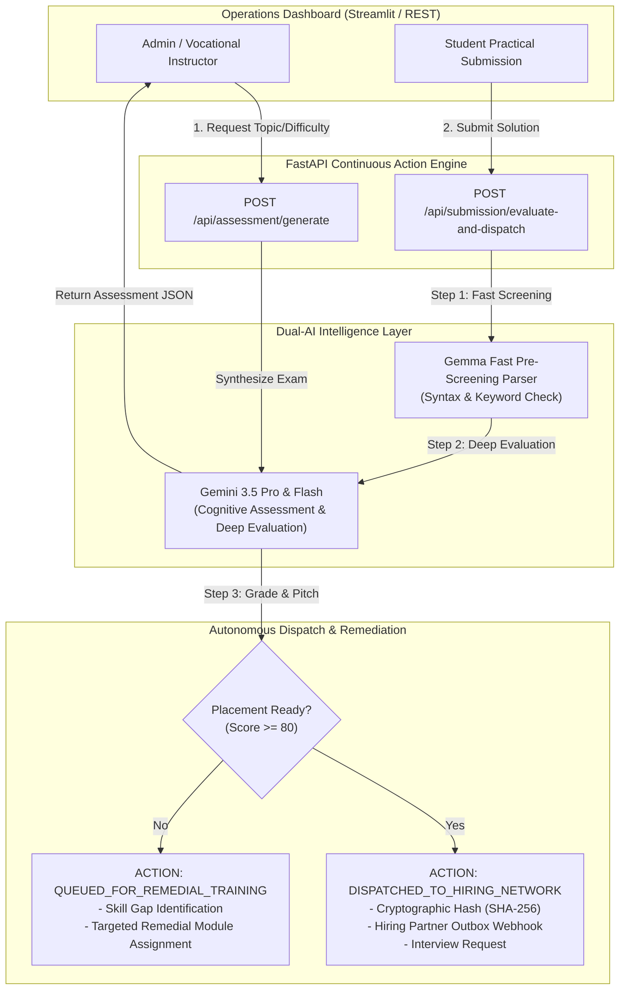

# ⚡ SkillForge Autonomous

> **Continuous Action Engine for Vocational Training Institutes & Job Placement**  
> *Built for Google All Things Agentic Hackathon — Category: Taskmaster Track*

---

## 🏆 Hackathon Quick Summary & Bonus Track

- **Track**: **Taskmaster Track** (Autonomous Continuous Action Engine — *No Chatbot UI / Zero Conversational Loops*).
- **Google AI Models**: **Gemini 3.5 Pro & Flash** (Cognitive Assessment Synthesis & Deep Multimodal Evaluation) + **Gemma** (Fast Keyword/Syntax Pre-Screening Parser).
- **Gemma Bonus (+0.2 pts)**: Integrated a lightweight Gemma pre-check pipeline for instantaneous structure/keyword verification prior to cognitive grading.
- **Autonomous Dispatch**: Automatically generates cryptographic scorecard verification hashes (`0x...`) and triggers direct outbox webhook payloads for employer recruitment or assigns remedial training modules.

---

## 📌 Problem Statement (BYOF - Bring Your Own Industry Focus)

Vocational training centers (e.g., automotive repair, CNC machining, electrical maintenance, web dev bootcamps) face three critical operational bottlenecks:

1. **Curriculum Synthesis Overhead**: Manually creating practical hands-on assessments, rubrics, and MCQs tailored to fast-evolving industry standards takes weeks.
2. **Evaluation Latency**: Instructors spend hundreds of hours manually grading technical diagnostic logs and practical student code/reports.
3. **Placement Pipeline Bottleneck**: High-performing candidates sit in administrative queues for weeks before being pitched to hiring partners.

**SkillForge Autonomous** replaces human administrative latency with an **autonomous 24/7 continuous action engine**.

---

## 🏗️ System Architecture



---

## 🛠️ Tech Stack & Google Services

| Component | Technology / Service | Role in SkillForge Autonomous |
| :--- | :--- | :--- |
| **Cognitive Reasoning** | **Google GenAI SDK (Gemini 3.5 Pro & Flash)** | Assessment synthesis, deep multimodal evaluation, candidate pitch generation |
| **Fast Pre-Screening** | **Gemma (Fast Parser/Check)** | **Gemma Bonus Track (+0.2 pts)**: Ultra-fast keyword, syntax, & structure validation |
| **Backend Engine** | **FastAPI & Pydantic** | Production RESTful service with structured output validation |
| **Frontend Ops** | **Streamlit** | Dual-tab operational dashboard for center managers & recruiters |
| **Cloud Runtime** | **Google Cloud Run** | Serverless containerized deployment |
| **Security & Metrics** | **SHA-256 Crypto Hashing** | Immutable metric verification for hiring partner outbox payloads |

---

## 🚀 Reproducibility & Local Spin-up Instructions

### Prerequisites
- Python 3.10+
- Google Gemini API Key (`GEMINI_API_KEY`)

### 1. Clone Repository & Setup Virtual Environment
```bash
git clone https://github.com/your-username/skillforge-autonomous.git
cd skillforge-autonomous

python -m venv venv
# On Windows:
venv\Scripts\activate
# On Linux/macOS:
source venv/bin/activate
```

### 2. Install Dependencies
```bash
pip install -r backend/requirements.txt
```

### 3. Configure Environment Variables
Copy `.env.example` to `.env` and set your API key:
```bash
cp backend/.env.example backend/.env
```
Edit `backend/.env`:
```env
GEMINI_API_KEY=your_actual_gemini_api_key_here
PORT=8000
```

### 4. Run Unified Application
Launch both the FastAPI backend and Streamlit dashboard concurrently:
```bash
python run_app.py
```
- **Backend API**: `http://localhost:8000` (Health check: `http://localhost:8000/health`)
- **Streamlit Dashboard**: `http://localhost:8501`

---

## 🧪 Verification & Automated Test Suites

To run the step-by-step verification scripts locally:

```bash
# Step 1 Test: Assessment Generation & Schema Validation
python backend/test_step1.py

# Step 2 Test: Dual-AI Evaluation & Recruiter Outbox Dispatch
python backend/test_step2.py
```

---

## ☁️ Google Cloud Run Production Deployment

To containerize and deploy directly to Google Cloud Run:

```bash
# Set GCP environment variables
export GEMINI_API_KEY="your_api_key"

# Make deployment script executable and run
chmod +x deploy_cloudrun.sh
./deploy_cloudrun.sh
```

Alternatively, build with Docker:
```bash
docker build -t skillforge-autonomous .
docker run -p 8000:8000 -p 8501:8501 -e GEMINI_API_KEY="your_api_key" skillforge-autonomous
```

---

## 📊 Hackathon Evaluation Criteria Alignment

| Criteria | Weight | How SkillForge Autonomous Delivers |
| :--- | :--- | :--- |
| **Category Fit: Taskmaster Track** | **Primary** | Functions as an autonomous continuous action engine. Zero generic chat interface; takes direct operational actions (assessment creation, automated scoring, hiring outbox dispatch). |
| **Gemma Integration Bonus** | **+0.2 Pts** | Integrates Gemma fast pre-screening for keyword/syntax structure verification before triggering Gemini 3.5 deep evaluation. |
| **Innovation & Actionability** | **40%** | Solves real-world vocational institute bottlenecks with end-to-end autonomous action (curriculum -> evaluation -> hiring outbox). |
| **Architecture & Code Quality** | **30%** | Clean FastAPI/Pydantic structure, Google GenAI SDK integration, Pydantic schema validation, and unit test coverage. |
| **Demo & Presentation** | **30%** | Production-grade 2-tab Streamlit UI with preset high-scoring & low-scoring demo cases. |

---

## 📄 License

Distributed under the MIT License. Built for the Google All Things Agentic Hackathon 2026.
