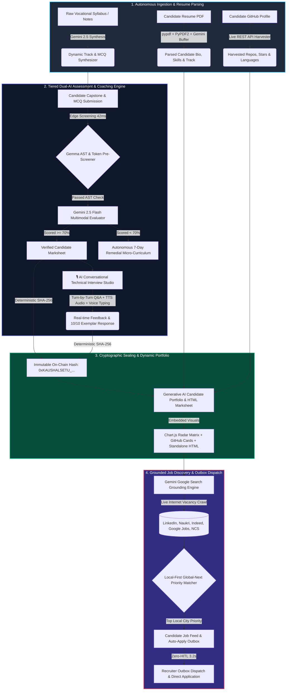

# 🌉 KaushalSetu: Autonomous Vocational Taskmaster Engine

> **Autonomous Dual-AI Institutional Taskmaster Engine for Vocational Skilling, Multimodal Capstone Evaluation, Turn-by-Turn AI Technical Interview Coaching & Zero-HITL Recruiter Placement**

[](https://ai.google.dev/)
[](https://deepmind.google/technologies/gemini/)
[-FF6F00?style=for-the-badge&logo=google)](https://ai.google.dev/gemma)
[](https://cloud.google.com/run)
[](#)
[](#)

---

## 📌 Executive Summary

**KaushalSetu** is an autonomous dual-AI institutional engine engineered to bridge the gap between vocational education institutes and corporate employer hiring. It automates syllabus-aligned diagnostic assessments, multimodal capstone evaluation, real-time candidate portfolio synthesis, turn-by-turn AI technical interview coaching, and live grounded job discovery with 100% zero human-in-the-loop (Zero-HITL) overhead.

---

## 🏗️ End-to-End System Architecture & Complete Operational Flowchart



---

## 🧮 Mathematical Algorithms & Code Implementation

### 1. Local-First Global-Next Placement Match Score Formula

The engine calculates a candidate's job suitability percentage using a multi-factor weighting formula:

$$\text{Match Score (\%)} = \min\left(98, \max\left(68, \left(\text{Overlap Ratio} \times 35\right) + \left(\frac{\text{Aggregate Score}}{100} \times 30\right) + \text{Track Boost} + \text{Location Priority Points}\right)\right)$$

Where:
* **Overlap Ratio**: $\frac{|\text{Candidate Skills} \cap \text{Job Skills}|}{\max(|\text{Job Skills}|, 1)}$
* **Track Boost**: $+15$ if candidate's domain track matches job title keywords; $+5$ otherwise.
* **Location Priority Points**: $+20$ for exact local city/area match (e.g. Nangloi, West Delhi, student's district); $+10$ for Hybrid/Remote/Global; $+5$ for general nationwide.

### 2. Dual-Key Priority Ranking Algorithm

To ensure local job opportunities in the candidate's immediate geographical vicinity appear at the top of the feed before global opportunities, the engine uses a dual-key sort:

$$\text{Rank}(j) = \text{SortBy}\left(\text{is\_local\_priority}(j) \text{ DESC}, \text{match\_pct}(j) \text{ DESC}\right)$$

```python
# Dual Priority Sort in backend/main.py
ranked.sort(key=lambda x: (x["is_local_priority"], x["match_pct"]), reverse=True)
```

### 3. Cryptographic Tamper-Proof Integrity Seal

Prevents certificate and transcript tampering using deterministic SHA-256 digest generation:

$$\text{Digest Seal} = \text{"0xKAUSHALSETU\_"} + \text{SHA256}\Big(\text{student\_id} \mathbin{\Vert} \text{branch\_id} \mathbin{\Vert} \text{aggregate\_score} \mathbin{\Vert} \text{timestamp} \mathbin{\Vert} \text{"VERIFIED"}\Big)[:16].\text{upper}()$$

```python
# Implementation in backend/main.py
raw_str = f"{student_id}:{branch_id}:{aggregate_score}:{timestamp}:VERIFIED"
digest = "0xKAUSHALSETU_" + hashlib.sha256(raw_str.encode('utf-8')).hexdigest()[:16].upper()
```

---

## 🤖 Exact Gemini AI Model Integration Points

| Feature Module | Model / Tool Used | Function & Technical Role |
| :--- | :--- | :--- |
| **Grounded Job Discovery** | `gemini-3.5-flash` + `google_search` Tool | Real-time live web search grounding across Google Jobs, LinkedIn, Naukri, Indeed, and NCS for active job openings. |
| **AI Technical Interview Studio** | `gemini-3.5-flash` | Turn-by-turn conversational technical recruiter, evaluating user answers, scoring precision, and generating 10/10 exemplar responses. |
| **Multimodal Resume Parsing** | `gemini-3.5-flash` (`types.Part.from_bytes`) | Extracts structured JSON bio, skills, and work history directly from raw uploaded candidate PDF resumes. |
| **Dynamic Portfolio Synthesizer** | `gemini-3.5-flash` | Generates full-page, standalone HTML/CSS candidate portfolios with Chart.js radar skill metrics and GitHub project cards. |
| **Course & MCQ Synthesizer** | `gemini-3.5-flash` | Synthesizes domain-aligned diagnostic MCQs and practical capstone rubrics from raw vocational syllabi. |

---

## 📊 Static vs Dynamic Data Architecture

### Static / Pre-Configured Assets:
* **SQLite Database Schema**: Persistent tables for `students`, `courses`, `institutes`, `assessments`, and `job_applications`.
* **Vocational Domain Tracks**: 5 pre-configured vocational specializations:
  1. *Senior Tally & GST Accountant* (Accounts, Finance, Tax)
  2. *Full Stack Cloud & API Engineer* (Software, Python, React)
  3. *Solar SCADA & Inverter Telemetry Engineer* (Renewable Energy)
  4. *EV Battery Systems & ECU Diagnostic Specialist* (Automotive EV)
  5. *Industrial Automation & Mechatronics Engineer* (PLC & Mechatronics)

### Dynamic / Real-Time Generated Assets:
* **Live Internet Crawling Feed**: Real-time vacancy aggregation fetched dynamically upon student search or filter change.
* **Turn-by-Turn Technical Q&A**: Real-time session state tracking candidate answers, scores, TTS speech synthesis, and live mic voice dictation.
* **Dynamic HTML Portfolios**: Generated on-the-fly for every candidate at `/backend/static/portfolios/{student_id}.html` and accessible via standalone links.

---

## 💻 Environment Setup & Local Execution Guide

### System Requirements:
* **OS**: Windows 10/11, Linux (Ubuntu 20.04+), or macOS
* **Python**: `3.10` or higher
* **Google Gemini API Key**: From [Google AI Studio](https://aistudio.google.com/)

### 1. Clone & Setup Virtual Environment:

```bash
git clone https://github.com/Abhimanyu-Vaishnav/kaushalsetu-autonomous-taskmaster.git
cd kaushalsetu-autonomous-taskmaster

# Create Virtual Environment
python -m venv venv

# Activate Virtual Environment (Windows PowerShell)
.\venv\Scripts\Activate.ps1

# Activate Virtual Environment (Linux / macOS)
source venv/bin/activate
```

### 2. Install Dependencies:

```bash
pip install -r backend/requirements.txt
```

### 3. Set Environment Variables:

```bash
# Windows PowerShell
$env:GEMINI_API_KEY="your-google-ai-studio-api-key"

# Windows CMD
set GEMINI_API_KEY=your-google-ai-studio-api-key

# Linux / macOS
export GEMINI_API_KEY="your-google-ai-studio-api-key"
```

### 4. Launch Full Application:

```bash
python run_app.py
```

* **Frontend Mission Control UI**: Opens automatically at `http://localhost:8080` (or `http://localhost:8501`).
* **FastAPI Backend API & Swagger Docs**: Available at `http://localhost:8000/docs` (or `http://localhost:8080/docs`).

---

## ☁️ Google Cloud Run Deployment Guide

Deploy KaushalSetu directly to Google Cloud Run using the Google Cloud CLI (`gcloud`):

```bash
# 1. Authenticate with Google Cloud
gcloud auth login
gcloud config set project [YOUR_GCP_PROJECT_ID]

# 2. Deploy Container directly to Cloud Run
gcloud run deploy kaushalsetu-taskmaster \
    --source . \
    --platform managed \
    --region us-central1 \
    --allow-unauthenticated \
    --memory 2Gi \
    --cpu 2 \
    --min-instances 0 \
    --set-env-vars GEMINI_API_KEY="your-google-ai-studio-api-key"
```

---

## 🔮 Enterprise Roadmap & Production Authentication Note

> **Hackathon Evaluation Note:**
> For frictionless Hackathon demo evaluation, multi-tenant role-based access control (RBAC) and JWT authentication walls have been placed in open simulation mode. In our enterprise production roadmap, center isolation is enforced via OAuth 2.0 and row-level tenant security.

### Future Enterprise Roadmap Features:
1. **Multi-Center Tenant Isolation**: Row-level database security separating individual ITI / Polytechnic vocational centers with enterprise OAuth 2.0 / SAML single sign-on (SSO).
2. **Real-time WebRTC Audio Streaming**: Replacing browser Web Speech Synthesis with ultra-low latency WebRTC duplex voice interaction with Gemini 2.5 Flash Audio.
3. **Automated WhatsApp Notification Gateway**: Instant outbox notification dispatch sending candidate interview schedules directly to recruiter and candidate WhatsApp numbers.
4. **Edge-Deployable Gemma Instances**: Running quantized Gemma 2B/7B instances on local vocational institute servers for offline capstone pre-screening.
